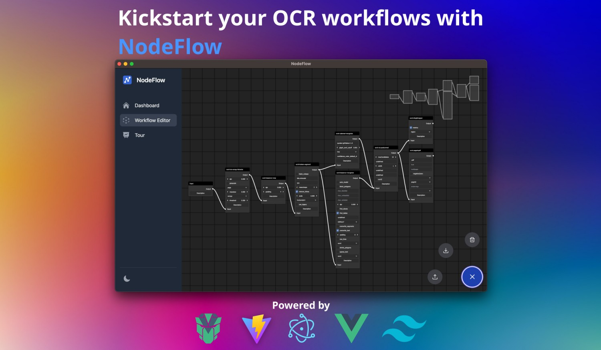

<p align="center">


</p>

NodeFlow is an open‑source, multi-platform desktop application for creating and managing OCR workflows. It allows beginner and advanced users to interactively craft everything from basic linear to complex branched workflows and export them for command line usage or for the usage in other applications like [OCR4all](https://github.com/OCR4all/OCR4all).


| WARNING: This is still a very early proof of concept with major missing features and possibly severe bugs! |
|------------------------------------------------------------------------------------------------------------|



# Features

NodeFlow provides the following features:

- Create and / or edit OCR workflows using a node editor (powered by [baklavajs](https://github.com/newcat/baklavajs))
- Leverage dozens of OCR processors (thanks to OCR-D) and configure all available parameters to your liking
- Interactively explore the processor and parameter documentation of every implemente OCR processor
- Export your workflows for command line usage or to use them in other OCR tools
- Interactively explore NodeFlow with the internal tour

## Getting Started

### 1. Install packages

```bash
yarn
```

### 2. Run

In development mode,

```bash
yarn app:dev
```

In preview mode,

```bash
yarn app:preview
```

To build for production,

```bash
yarn app:build
```
